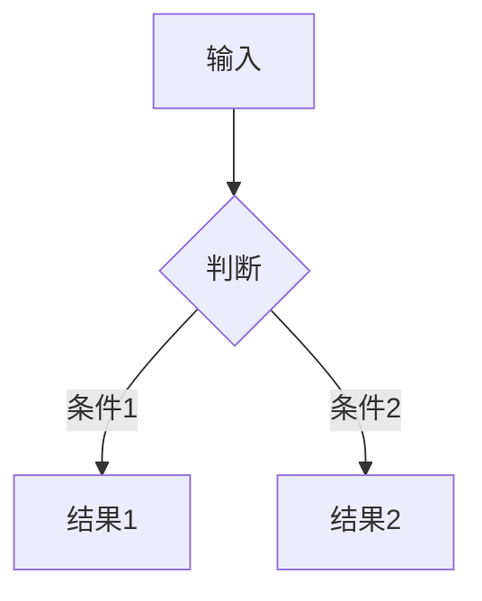

# 低代码平台 🚀


> 一句话描述项目的核心价值

## 📌 目录
- [功能特性](#✨-功能特性)
- [快速开始](#🚀-快速开始)
- [安装指南](#🔧-安装指南)
- [使用示例](#🎯-使用示例)
- [配置说明](#⚙️-配置说明)
- [贡献指南](#🤝-贡献指南)
- [许可证](#📜-许可证)

## ✨ 功能特性
- **核心功能1**：描述 + 技术亮点
- **核心功能2**：对比同类方案的优势
- 支持的功能列表（使用表格更专业）：

| 功能       | 支持状态 | 备注          |
|------------|----------|---------------|
| 多平台     | ✅        | Windows/macOS |
| 插件系统   | 🚧        | 开发中        |

## 🚀 快速开始
```bash
# 最小化运行示例
npm install
npm start
```

## 🔧 安装指南
### 环境要求
- Node.js >= 20.12.0
- Python 3.8+

### 安装步骤
1. 克隆仓库：
   ```bash
   git clone https://github.com/用户名/仓库.git
   ```
2. 安装依赖：
   ```bash
   cd 项目目录 && pip install -r requirements.txt
   ```

## 🎯 使用示例
### 基础用法
```python
from package import Module
instance = Module()
print(instance.method())
```

### 高级用法（带流程图）


## ⚙️ 配置说明
通过 `config.yaml` 配置：
```yaml
server:
  port: 8080
  logging: true
```

## 🤝 贡献指南
1. Fork 项目
2. 创建分支 (`git checkout -b feat/新功能`)
3. 提交更改 (`git commit -m '添加新功能'`)
4. 推送分支 (`git push origin feat/新功能`)
5. 发起 Pull Request

## 📜 许可证
[MIT](LICENSE) © 2023 [你的名字]
